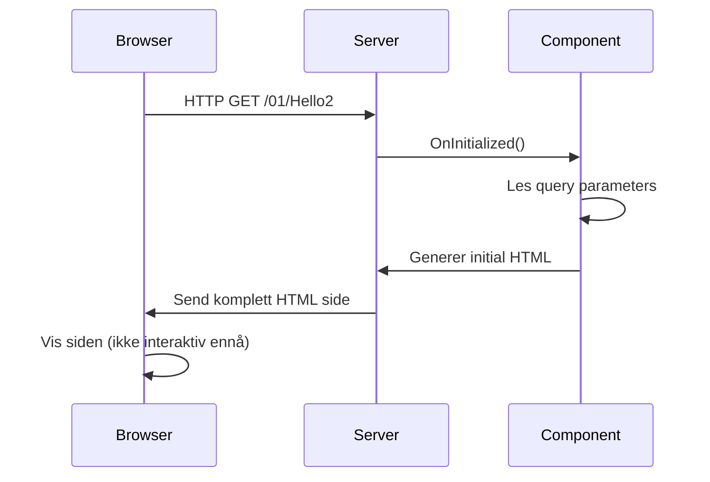
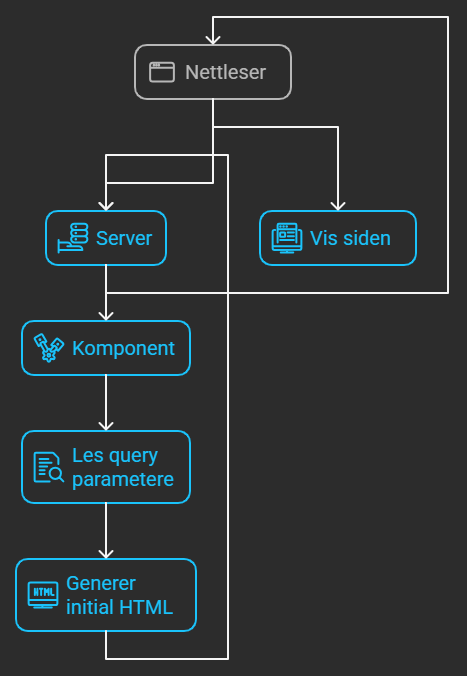
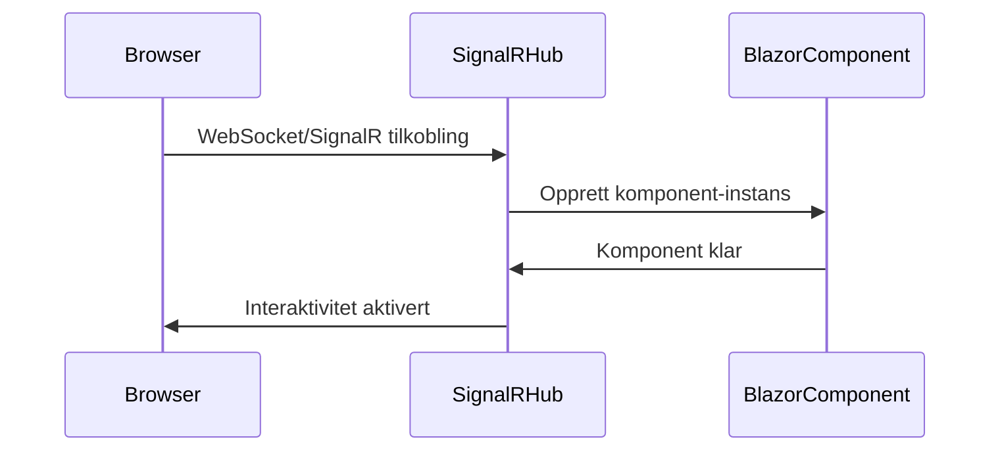
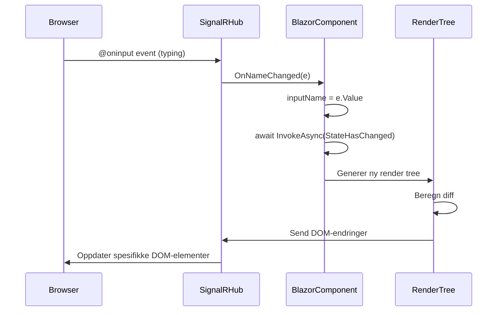
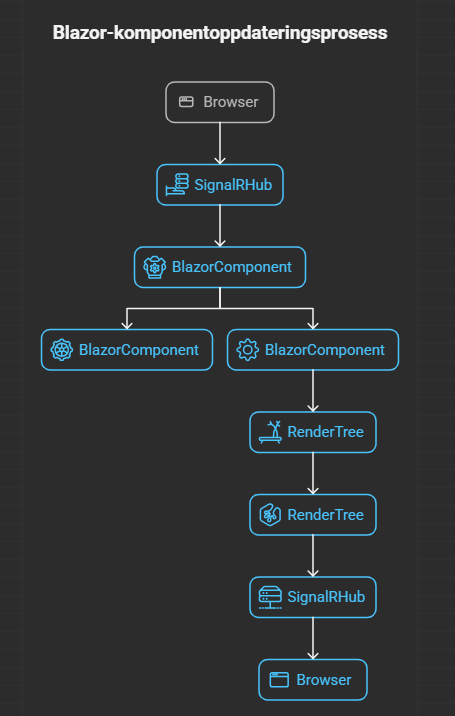
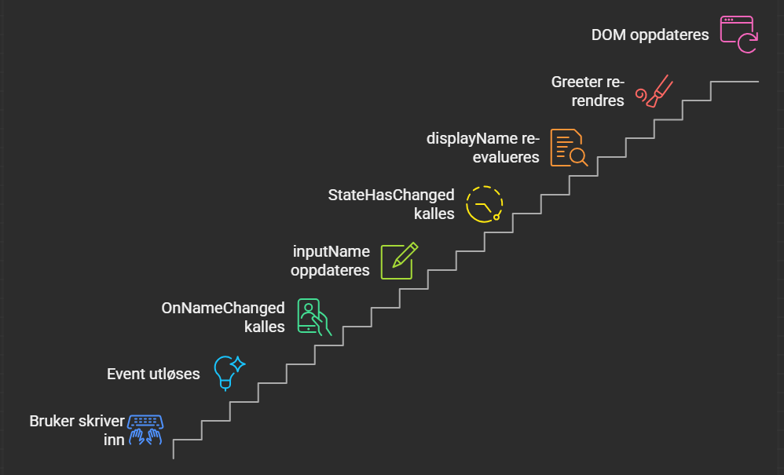

# 🚀 Blazor Server - Teknisk Prosessforklaring

## 📋 Oversikt

Denne dokumentasjonen forklarer detaljert hva som skjer når `await InvokeAsync(StateHasChanged)` kalles i Blazor Server, og hele kommunikasjonsflyten mellom klient og server.

---

## 🔄 `await InvokeAsync(StateHasChanged)` - Hva skjer?

### 📝 Kort forklaring

```csharp
await InvokeAsync(StateHasChanged);
```

Denne linjen forteller Blazor at komponentens tilstand har endret seg og at UI-en må oppdateres. Den trigger en re-rendering av komponenten og sender oppdateringer til klienten via SignalR.

### 🔧 Detaljert prosess

1. **InvokeAsync()** - Sikrer at koden kjører på riktig tråd (Dispatcher thread)
2. **StateHasChanged()** - Markerer komponenten som "dirty" (må re-rendres)
3. **Re-rendering** - Blazor genererer ny HTML/DOM
4. **Diff-beregning** - Sammenligner gammel vs ny DOM
5. **SignalR-oppdatering** - Sender bare endringene til klienten

<div style="page-break-after:always;"></div>

## 🌐 Fullstendig Kommunikasjonsflyt

### 1️⃣ **Initial Lasting (Server-Side Rendering)**





<div style="page-break-after:always;"></div>

### 2️⃣ **SignalR Oppkobling**




### 3️⃣ **Brukerinteraksjon og State-oppdatering**





<div style="page-break-after:always;"></div>

## 🛠️ Kodeeksempler med Forklaringer

### 📊 Databinding Eksempler

#### **One-Way Binding**
```csharp
// I Hello2.razor
<input type="text" value="@inputName" />

@code {
    private string inputName = "Initial verdi";
    // Data flyter bare fra C# til HTML
}
```

#### **Two-Way Binding**
```csharp
// Automatisk two-way binding
<input type="text" @bind="inputName" />

// Tilsvarer:
<input type="text" value="@inputName" 
       @oninput="@((e) => inputName = e.Value.ToString())" />
```

#### **Manual Event Handling (som i Hello2.razor)**
```csharp
<input type="text" @oninput="OnNameChanged" value="@inputName" />

@code {
    private async Task OnNameChanged(ChangeEventArgs e)
    {
        inputName = e.Value?.ToString() ?? "";
        // Manuell state-oppdatering kreves!
        await InvokeAsync(StateHasChanged);
    }
}
```
<div style="page-break-after:always;"></div>

### 🎯 Event-håndtering Dypere Forklaring

#### **Automatisk vs Manuell State Management**

```csharp
// ✅ Automatisk - StateHasChanged kalles automatisk
<button @onclick="AutomaticUpdate">Klikk meg</button>
@code {
    private void AutomaticUpdate()
    {
        // Blazor kaller StateHasChanged automatisk
        inputName = "Oppdatert automatisk";
    }
}

// ⚠️ Manuell - må kalle StateHasChanged selv
<input @oninput="ManualUpdate" />
@code {
    private async Task ManualUpdate(ChangeEventArgs e)
    {
        inputName = e.Value?.ToString() ?? "";
        // MÅ kalle dette for UI-oppdatering!
        await InvokeAsync(StateHasChanged);
    }
}
```
<div style="page-break-after:always;"></div>

### 🔄 Lifecycle og State Management

```csharp
@code {
    protected override void OnInitialized()
    {
        // Kjøres på server under initial rendering
        // StateHasChanged ikke nødvendig her
    }

    protected override async Task OnAfterRenderAsync(bool firstRender)
    {
        if (firstRender)
        {
            // Første gang siden er rendret
            // SignalR-tilkobling er etablert
        }
        
        // Hvis du gjør endringer her, må du kalle:
        // await InvokeAsync(StateHasChanged);
    }
}
```
<div style="page-break-after:always;"></div>

## 🔍 Teknisk Arkitektur

### 🖥️ **Server-Side Prosessing**

```csharp
// Blazor Server Pipeline
1. Event mottas via SignalR
2. Event håndteres i C# kode
3. State endres (variabler)
4. StateHasChanged() kalles
5. Render tree bygges på nytt
6. Diff beregnes (hva har endret seg?)
7. Bare endringene sendes til klient
```

### 🌍 **Klient-Side Prosessing**

```javascript
// Blazor JavaScript runtime (automatisk)
1. Motta DOM-endringer via SignalR
2. Finn riktige DOM-elementer
3. Oppdater bare endrede attributter/innhold
4. Preservér focus og scroll-posisjon
```

### 📡 **SignalR Kommunikasjon**

```json
// Eksempel på SignalR-melding
{
  "type": "RenderBatch",
  "edits": [
    {
      "type": "updateText",
      "elementId": "blazor-element-123",
      "newText": "Nytt navn (Nytt kallenavn)"
    }
  ]
}
```

<div style="page-break-after:always;"></div>

## 🧩 Detaljert Hello2.razor Analyse

### 📝 **Komponent State**

```csharp
// Private fields - komponentens tilstand
private string inputName = "";        // Brukerens navn
private string greeting = "Hello";    // Hilsen-tekst  
private string? nick;                 // Kallenavn (nullable)

// Computed property - beregnes automatisk
private string displayName => $"{(string.IsNullOrWhiteSpace(inputName) ? "Verden" : inputName)} ({nick ?? "El Mundo"})";
```

### 🎯 **Event Flow Diagram**

```
Bruker skriver i input field ➡️
@oninput event utløses ➡️        
OnNameChanged(ChangeEventArgs e) kalles ➡️        
inputName = e.Value?.ToString() ?? ""; ➡️
await InvokeAsync(StateHasChanged); ➡️        
displayName property re-evalueres ➡️        
<Greeter> komponent får nytt Target="@displayName" ➡️        
Greeter re-rendres med ny verdi ➡️        
DOM oppdateres via SignalR ➡️        
Bruker ser oppdateringen i sanntid
```



<div style="page-break-after:always;"></div>

## ⚡ Performance og Optimalisering

### 🚀 **Når StateHasChanged kalles**

```csharp
// ✅ Nødvendig - manuell event handling
private async Task OnInputChanged(ChangeEventArgs e)
{
    value = e.Value?.ToString();
    await InvokeAsync(StateHasChanged); // PÅKREVD
}

// ✅ Automatisk - event handlers som ikke er async
private void OnClick()
{
    counter++;
    // StateHasChanged kalles automatisk
}

// ❌ Ikke nødvendig - @bind håndterer det
<input @bind="value" @bind:event="oninput" />
```

### 🎛️ **ShouldRender Optimalisering**

```csharp
protected override bool ShouldRender()
{
    // Kontroller når komponenten skal re-rendres
    return hasChanges; // bare render hvis det faktisk er endringer
}
```

<div style="page-break-after:always;"></div>

## 🔒 Sikkerhet og Begrensninger

### ⚠️ **Viktige Punkter**

1. **Server-side validering** - All logikk kjører på server
2. **Nettverkslatency** - Hver interaksjon krever server-roundtrip
3. **Skalering** - Server holder tilstand for hver klient
4. **Forbindelsestap** - Reconnection-logic håndteres automatisk

### 🛡️ **Security Implications**

```csharp
// ✅ Sikker - validering på server
private async Task SaveData(string userInput)
{
    // Server-side validering
    if (string.IsNullOrWhiteSpace(userInput))
        return;
        
    // Business logic kjører trygt på server
    await DatabaseService.SaveAsync(userInput);
    await InvokeAsync(StateHasChanged);
}
```

<div style="page-break-after:always;"></div>

## 📚 Sammendrag

### 🎯 **Key Takeaways**

1. **`await InvokeAsync(StateHasChanged)`** forteller Blazor å re-rendre komponenten
2. **SignalR** håndterer all kommunikasjon mellom klient og server
3. **Bare endringene** sendes over nettverket (effektiv DOM-diffing)
4. **Server-side rendering** gir sikkerhet men krever nettverkstilkobling
5. **Automatisk reconnection** håndterer forbindelsestap

### 🔄 **Når bruke StateHasChanged**

- ✅ Manuell event-håndtering (som i Hello2.razor)
- ✅ Async operations som endrer state
- ✅ Timer/background tasks som oppdaterer UI
- ❌ Ikke nødvendig med @bind
- ❌ Ikke nødvendig med vanlige @onclick handlers

