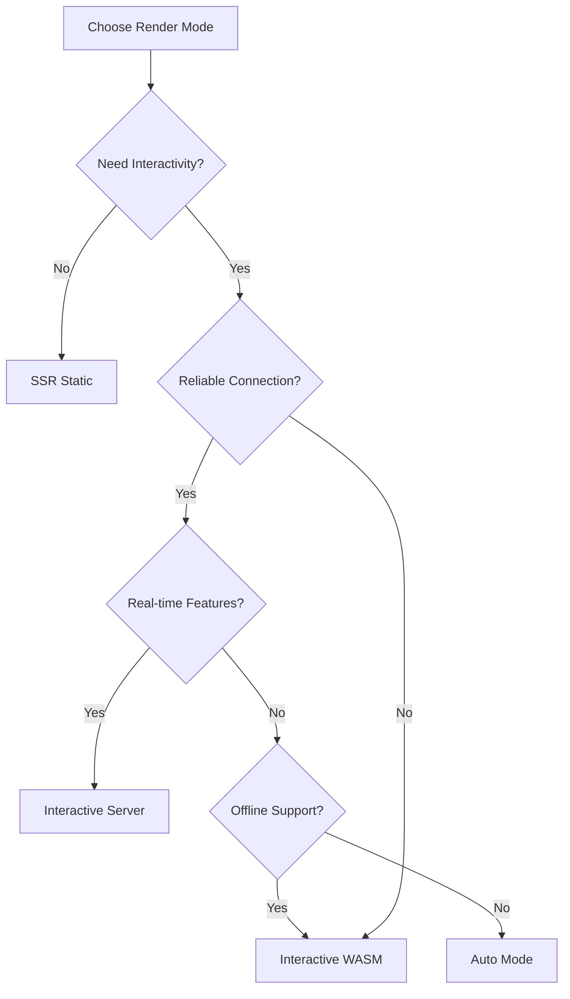

# 🎭 Render Modes Playground

## 🎯 Mål
Forstå de fire forskjellige render modes i Blazor og deres trade-offs: **SSR (Static)**, **Interactive Server**, **Interactive WASM**, og **Auto**.

## 📚 Konsepter som dekkes

### 🏗️ Render Modes Oversikt

#### 1. 📄 SSR (Static Server-Side Rendering)
```csharp
// No @rendermode specified = defaults to SSR
<MyComponent />
```

**Når bruker SSR:**
- **Content-heavy websites** (blogs, documentation, news sites)
- **SEO-critical pages** (landing pages, product pages)
- **Fast initial load** is priority
- **Minimal interactivity** needed

**Fordeler:**
- ⚡ Fastest initial page load
- 🔍 Perfect SEO - content is in HTML
- 📱 Works on any device/browser
- 🌐 No JavaScript required
- 💾 Minimal bandwidth usage

**Ulemper:**
- 🚫 No client-side interactivity
- 🔄 Full page reload for updates
- 📝 Static content only

<div style="page-break-after:always;"></div>

#### 2. ⚡ Interactive Server
```csharp
@rendermode InteractiveServer
<MyComponent />
```

**Når bruker Server:**
- **Rich interactive applications** (dashboards, admin panels)
- **Reliable internet connection** available
- **Real-time features** needed (chat, live updates)
- **Server-side security** requirements

**Fordeler:**
- 🚀 Low latency interactions
- 🔒 Server-side security and validation
- 💾 Small client footprint
- 🛠️ Full .NET server capabilities
- 🔄 Real-time updates via SignalR

**Ulemper:**
- 📡 Requires active internet connection
- 🌐 Network dependency affects performance
- 🏗️ Server load increases per user
- ❌ No offline capability

<div style="page-break-after:always;"></div>

#### 3. 🌐 Interactive WASM (WebAssembly)
```csharp
@rendermode InteractiveWebAssembly
<MyComponent />
```

**Når bruker WASM:**
- **Offline applications** (PWAs, mobile apps)
- **Complex client-side logic** (games, calculations)
- **Reduced server load** is priority
- **Network-independent** functionality needed

**Fordeler:**
- 🔌 Complete offline capability
- ⚡ High-performance client processing
- 🏗️ Reduces server load
- 🌐 Rich browser API access
- 📱 Native-like performance

**Ulemper:**
- 📦 Large initial download (MB of .NET runtime)
- 🐌 Slower startup time
- 🔍 Limited SEO capabilities
- 💾 Higher memory usage
- 🔧 More complex debugging

<div style="page-break-after:always;"></div>

#### 4. 🎯 Auto (Progressive Enhancement)
```csharp
@rendermode InteractiveAuto
<MyComponent />
```

**Når bruker Auto:**
- **Production applications** with diverse users
- **Best user experience** is priority
- **Hybrid scenarios** (some offline, some server features)
- **Progressive enhancement** strategy

**Hvordan Auto fungerer:**
1. **Initial Load (SSR)** - Static HTML rendered instantly
2. **Server Interactive** - SignalR connection enables interactivity
3. **WASM Download** - WebAssembly loads in background
4. **Client Switch** - Seamlessly switches to WASM when ready

**Fordeler:**
- 🚀 Fast initial load (SSR)
- 🔍 Great SEO (server-rendered content)
- ⚡ Progressive enhancement
- 🌐 Offline capability (after WASM loads)
- 🎯 Best of all worlds

**Ulemper:**
- 🔧 More complex to understand
- 📦 Eventually downloads full WASM payload
- 🎭 State transition complexity

<div style="page-break-after:always;"></div>

## 🏗️ Arkitektur Sammenligning

```
┌─────────────────────────────────────────────────────────────┐
│                    Render Mode Architecture                  │
├─────────────────┬─────────────────┬─────────────────┬─────────┤
│      SSR        │ Interactive     │ Interactive     │  Auto   │
│   (Static)      │    Server       │     WASM        │  Mode   │
├─────────────────┼─────────────────┼─────────────────┼─────────┤
│                 │                 │                 │         │
│ ┌─────────────┐ │ ┌─────────────┐ │ ┌─────────────┐ │ ┌─────┐ │
│ │   Browser   │ │ │   Browser   │ │ │   Browser   │ │ │ B ↔ │ │
│ │             │ │ │      ↕      │ │ │             │ │ │ r   │ │
│ │    HTML     │ │ │   SignalR   │ │ │  .NET WASM  │ │ │ o S │ │
│ │   (Static)  │ │ │             │ │ │  Runtime    │ │ │ w e │ │
│ └─────────────┘ │ └─────────────┘ │ └─────────────┘ │ │ s r │ │
│                 │        ↕        │                 │ │ e v │ │
│                 │ ┌─────────────┐ │                 │ │ r e │ │
│ No server       │ │   Server    │ │ No server       │ │   ↓ │ │
│ interaction     │ │ .NET Runtime│ │ interaction     │ │ WASM│ │
│ after load      │ └─────────────┘ │ after load      │ └─────┘ │
└─────────────────┴─────────────────┴─────────────────┴─────────┘
```

## ⚖️ Performance Trade-offs

### 📊 Metrics Comparison

| Aspect | SSR | Server | WASM | Auto |
|--------|-----|--------|------|------|
| **Initial Load** | 🟢 ~50ms | 🟡 ~200ms | 🔴 ~2000ms | 🟢 ~50ms |
| **Time to Interactive** | ❌ Never | 🟢 ~300ms | 🔴 ~3000ms | 🟢 ~300ms |
| **Offline Support** | 🟡 Cached only | ❌ None | 🟢 Full | 🟡 After WASM |
| **SEO Capability** | 🟢 Perfect | 🟢 Good | 🔴 Limited | 🟢 Perfect |
| **Bundle Size** | 🟢 ~10KB | 🟢 ~50KB | 🔴 ~2MB | 🟡 ~2MB (eventual) |
| **Memory Usage** | 🟢 Low | 🟢 Low | 🔴 High | 🟡 Variable |
| **Server Load** | 🟢 Minimal | 🔴 High | 🟢 Minimal | 🟡 Variable |

### 🎯 Decision Matrix


<div style="page-break-after:always;"></div>

## 🧪 Øvelser og Eksperimenter

### 1. **Performance Testing**
- Open DevTools → Network tab
- Throttle to "Slow 3G"
- Compare responsiveness between Server and WASM components
- Measure time-to-interactive for each mode

### 2. **Offline Testing**
- Disconnect from internet
- Test which components still work
- Observe differences in functionality

### 3. **SEO Testing**
- View page source
- Compare HTML content between render modes
- Test with web crawlers or SEO tools

### 4. **Network Simulation**
- Use built-in network delay simulator
- Test Server components with different latencies
- Compare user experience across modes

### 5. **Bundle Analysis**
- Check browser Network tab for downloaded files
- Compare bundle sizes between modes
- Analyze loading patterns

<div style="page-break-after:always;"></div>

## 🔧 Implementation Details

### Component Registration
```csharp
// Program.cs
var builder = WebApplication.CreateBuilder(args);

builder.Services.AddRazorComponents()
    .AddInteractiveServerComponents()
    .AddInteractiveWebAssemblyComponents();

var app = builder.Build();

app.MapRazorComponents<App>()
    .AddInteractiveServerRenderMode()
    .AddInteractiveWebAssemblyRenderMode();
```

### Per-Component Configuration
```csharp
// Static SSR (default)
<MyComponent />

// Server-side interactive
<MyComponent @rendermode="InteractiveServer" />

// Client-side WASM
<MyComponent @rendermode="InteractiveWebAssembly" />

// Auto mode (progressive enhancement)
<MyComponent @rendermode="InteractiveAuto" />
```

### Page-level Configuration
```csharp
@page "/my-page"
@rendermode InteractiveServer

// All components on this page inherit the render mode
```
<div style="page-break-after:always;"></div>

## 🎓 Læringsmål

### Etter denne øvelsen skal du forstå:

1. **Render Mode Characteristics**
   - When to use each render mode
   - Performance implications of each choice
   - Trade-offs between modes

2. **Progressive Enhancement**
   - How Auto mode provides the best user experience
   - SSR → Server → WASM transition flow
   - Benefits of hybrid approaches

3. **Performance Optimization**
   - Initial load time vs. time-to-interactive
   - Bundle size impact on user experience
   - Network dependency considerations

4. **Architecture Decisions**
   - Choosing the right mode for different scenarios
   - Mixing render modes within applications
   - Production deployment considerations

<div style="page-break-after:always;"></div>

## 🚀 Production Recommendations

### 🎯 **Use Auto Mode for:**
- Production web applications
- Mixed content (static + interactive)
- Users with varying network conditions
- SEO + interactivity requirements

### ⚡ **Use Server Mode for:**
- Admin dashboards
- Real-time applications
- Reliable network environments
- Server-side security requirements

### 🌐 **Use WASM Mode for:**
- Progressive Web Apps (PWAs)
- Offline-first applications
- Compute-intensive client applications
- Minimal server infrastructure

### 📄 **Use SSR Mode for:**
- Content websites
- Landing pages
- Documentation sites
- Maximum SEO optimization

## 🔗 Relaterte konsepter
- **Progressive Web Apps (PWA):** Combining WASM with service workers
- **Hydration:** How static content becomes interactive
- **Code Splitting:** Optimizing WASM bundle loading
- **Streaming SSR:** Improving perceived performance